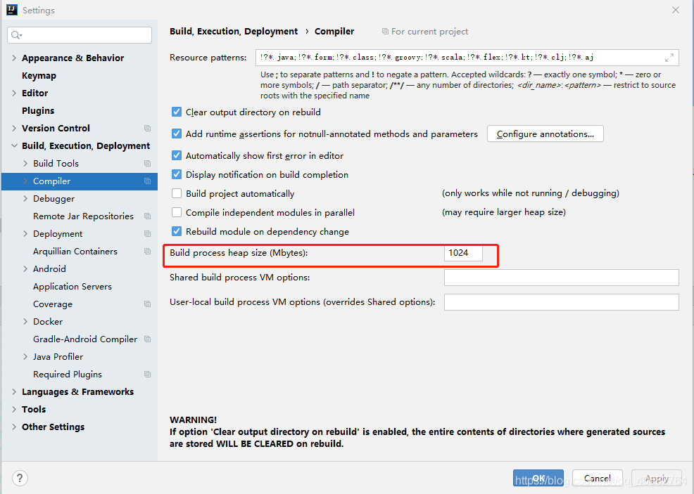
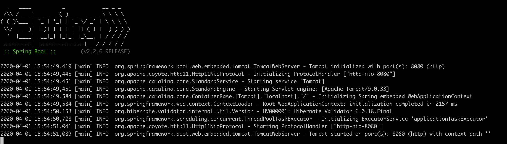
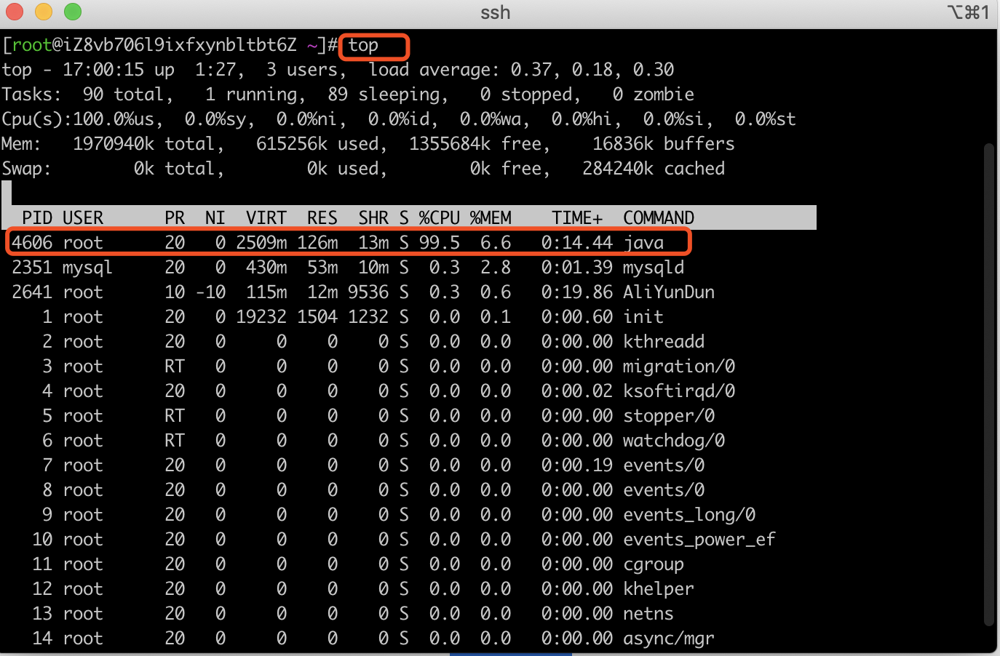
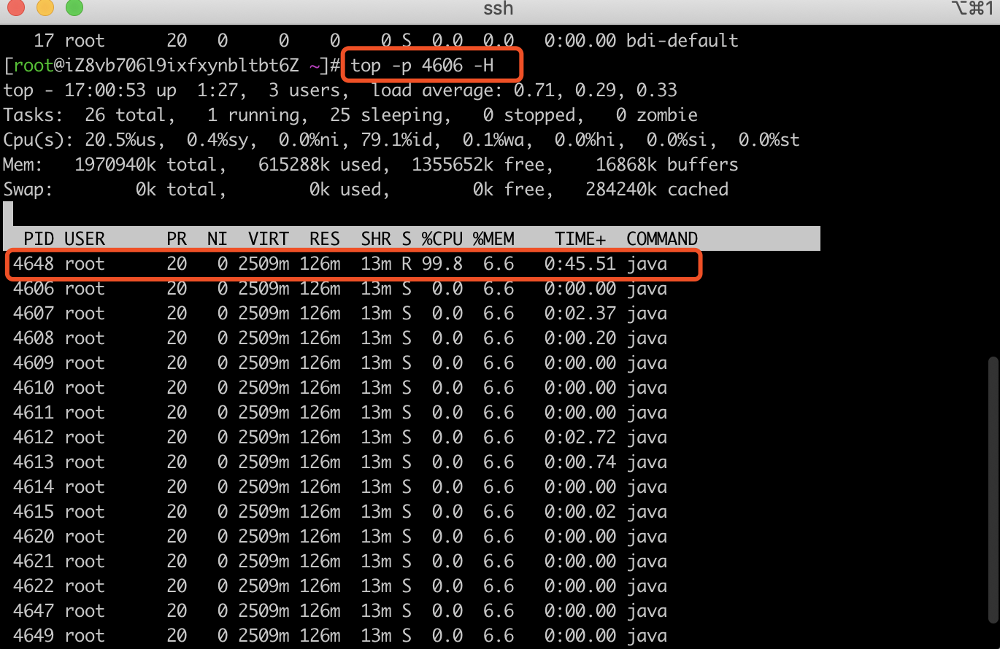
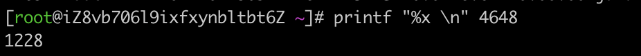
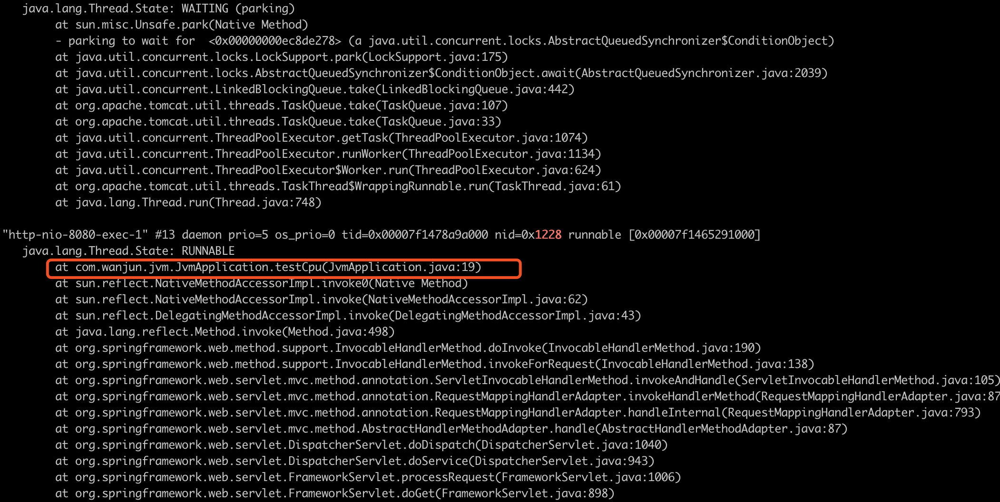

### intellij idea内存溢出

#### 问题描述

使用Idea运行代码量比较多的项目时，会报错：java.lang.OutOfMemoryError: Java heap space

#### 问题处理

这个显而易见是堆内存溢出，首先想到的时tomcat的内存分配太小了，调整Idea的内存分配：
Help–>Edit Custom VM Options–>
将配置改为以下内容:

```
-server
-Xms512m  #JVM启动时分配的内存
-Xmx1024m #JVM运行时内存
-XX:ReservedCodeCacheSize=300m
-XX:+UseConcMarkSweepGC
-XX:SoftRefLRUPolicyMSPerMB=50
-ea
-Dsun.io.useCanonCaches=false
-Djava.net.preferIPv4Stack=true
-Djdk.http.auth.tunneling.disabledSchemes=""
-XX:+HeapDumpOnOutOfMemoryError
-XX:-OmitStackTraceInFastThrow
123456789101112
```

修改之后restart一下idea，然后再次启动项目，一顿操作猛如虎。
？？？？
还是报错:`java.lang.OutOfMemoryError: GC overhead limit exceeded`
手动推一推眼镜，应该是漏掉了什么。
仔细看了整个报错过程，堆溢出的错误不是在代码compiler时报出来的。
在代码compiler之前有一个build(构建)过程，报错是在这里报出来的。
检查相应配置File–>settings–>Build,Execution,Deployment–>Compiler选项中有一个地方和堆大小有关
即下图:

此处的大小从700M—>1024M后，重新启动项目，问题就搞定了。

#### 反思

1.正常项目一般512M就没啥问题了，这个问题出现之后查好多都是说调整tomcat的配置就可以了，没有注意到compiler之前的build过程，所以走了弯路
2.一个项目文件太多时，就差不多就要考虑进行拆分了，楼主运行的这个项目已经有70000多个类，整体代码量非常大。

### 服务器出现cpu占用过高

记录一次线上服务器出现cpu占用过高，避免之后再次出现相关问题。

#### 用代码模拟cpu占用过高

新建一个[web项目](https://so.csdn.net/so/search?q=web项目&spm=1001.2101.3001.7020)，这里以springboot为例子新建一个web项目

```java
package com.wanjun.jvm;
 
import org.springframework.boot.SpringApplication;
import org.springframework.boot.autoconfigure.SpringBootApplication;
import org.springframework.web.bind.annotation.RequestMapping;
import org.springframework.web.bind.annotation.RestController;
 
@SpringBootApplication
@RestController
public class JvmApplication {
 
    public static void main(String[] args) {
        SpringApplication.run(JvmApplication.class, args);
    }
    //这里写个死循环 模拟 cpu 占用
    @RequestMapping("/cpu")
     public String testCpu() { 
        System.out.println("request cpu");
        while (true) {
            
        }
     }
}
```

将项目部署到linux 服务器上

启动项目



访问

curl localhost:8080/cpu

#### 排查

查看占用cpu高的进程 ，**top**

如下图：可看出PID为4060的java进程占用cpu最高，达到了99.5%




查看子进程情况：

top -p 4606 -H 

 

将 子进程id 转换成16进制

printf "%x \n" 4648

 

 

 #### 查询具体出现问题的代码位置

 jstack 4606|grep 1228 -C 30

 如下图：可看出是JvmApplication类的第19行出现问题



 