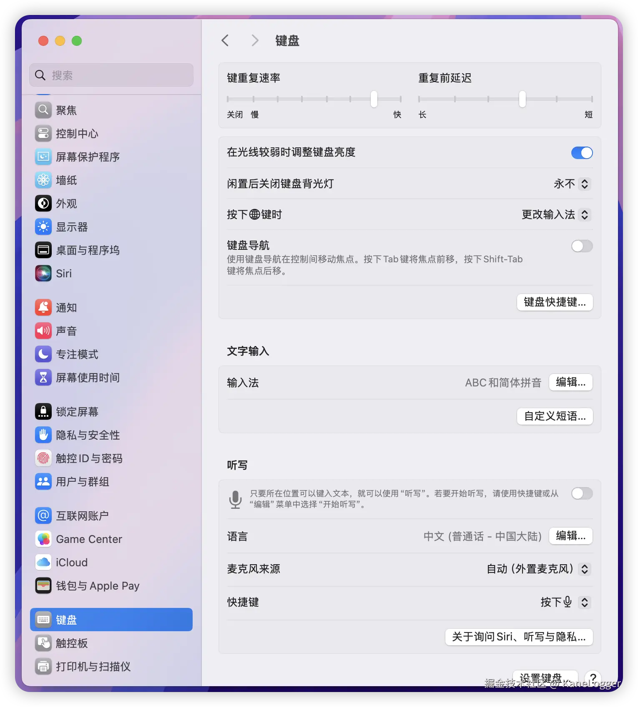
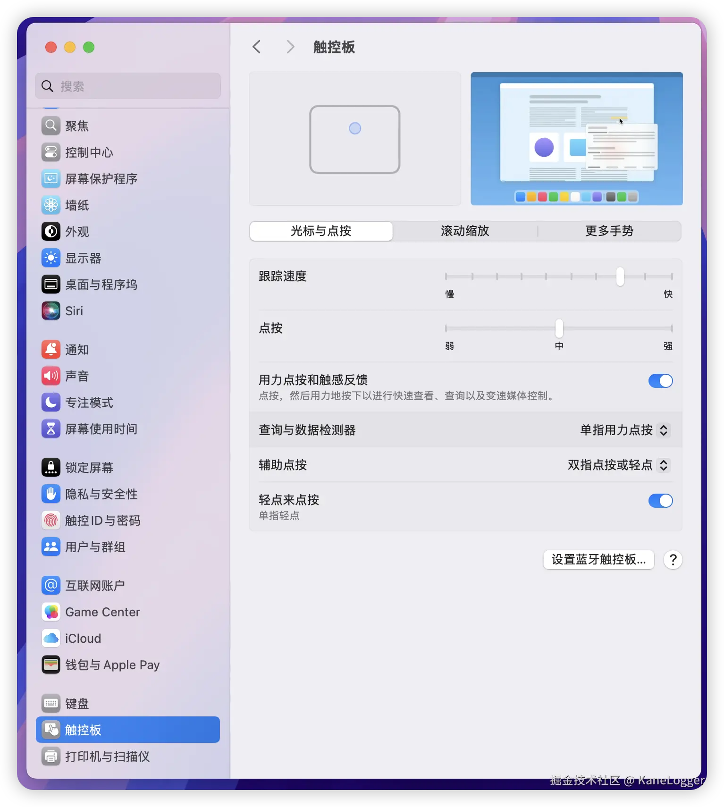
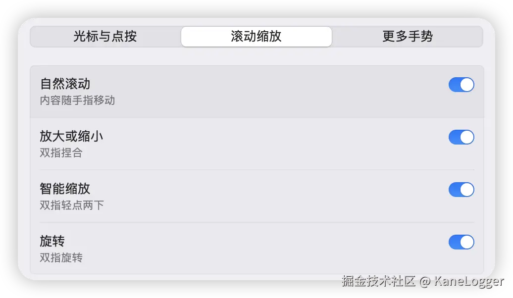
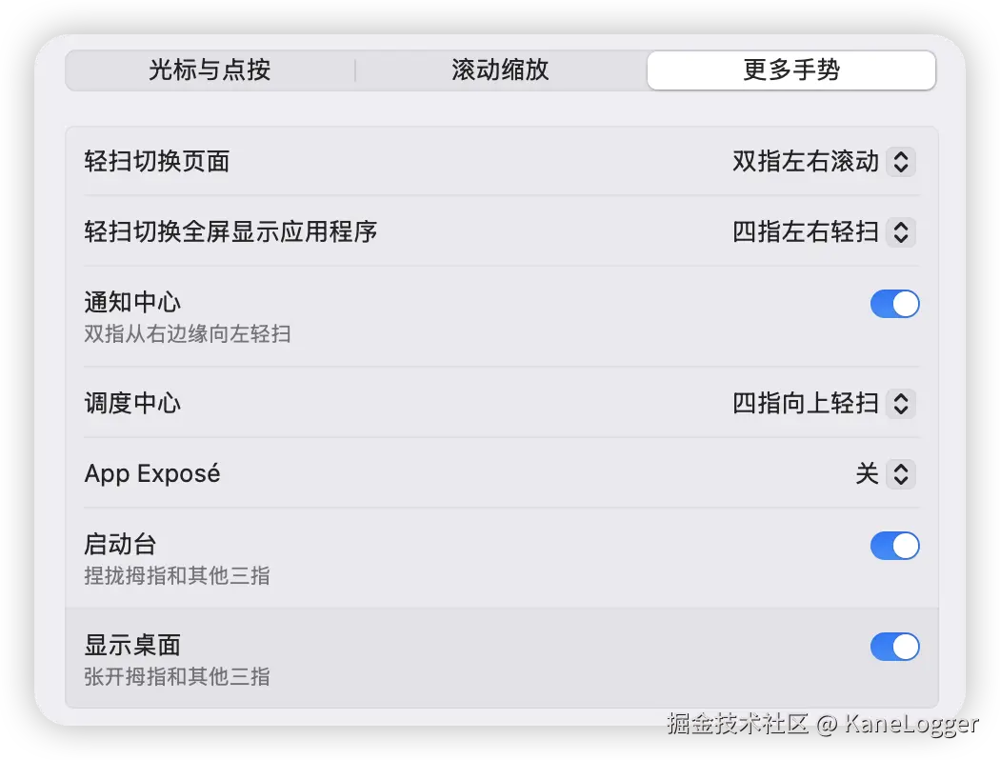
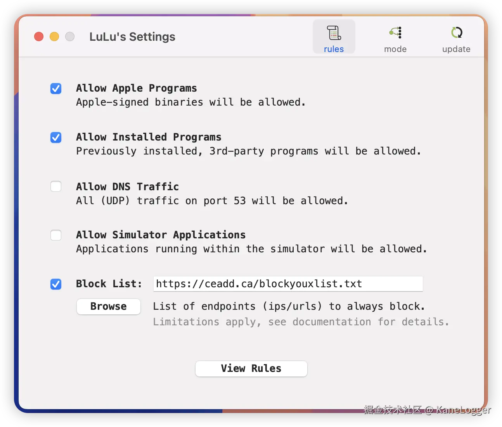

# 【自用】Mac 从开箱到开发

原文链接: [https://juejin.cn/post/7441427818728636467?searchId=20260128135055AF5C589A9697EA813EED](https://juejin.cn/post/7441427818728636467?searchId=20260128135055AF5C589A9697EA813EED)

---

## 验机

- [设备序列号](https://checkcoverage.apple.com/?locale=zh_CN)
- 开机 -> 苹果按钮，点击关于本机 -> 系统报告 -> 核对型号参数 -> 点击电源，效能信息循环计数10次以下为正常

## 系统设置

### 键盘




### 触控板










## 常用软件

### 软件商店

- [appstorrent](https://appstorrent.ru/)俄罗斯网站
- [MacYY](https://maczz.net/)
- [第一个网站的资源](https://xmac.app/app?page=2)
- [Mac 软件下载](https://www.downpj.com/)

### 前置工作

1. 安装 Xcode Command Line Tools `xcode-select --install`

#### 安装任意来源的 App

1. 允许安装任意来源的 App `sudo spctl --master-disable`
1. 系统偏好设置 -> 安全性与隐私 -> 点击左下角的小锁

#### Homebrew

安装

```sh
# 正常
/bin/bash -c "$(curl -fsSL https://raw.githubusercontent.com/Homebrew/install/HEAD/install.sh)"
# 国内环境
/bin/bash -c "$(curl -fsSL https://gitee.com/ineo6/homebrew-install/raw/master/install.sh)"

# 卸载
/bin/bash -c "$(curl -fsSL https://raw.githubusercontent.com/Homebrew/install/HEAD/uninstall.sh)"
# 国内
/bin/bash -c "$(curl -fsSL https://gitee.com/ineo6/homebrew-install/raw/master/uninstall.sh)"

```

**如果**出现卡顿`==> Tapping homebrew/core Cloning into ‘/usr/local/Homebrew/Library/Taps/homebrew/homebrew-core’…`需要先换源，然后再安装：

```sh
cd "$(brew --repo)/Library/Taps/"
mkdir homebrew && cd homebrew
git clone https://mirrors.ustc.edu.cn/homebrew-core.git
# 再执行
/bin/bash -c "$(curl -fsSL https://gitee.com/ineo6/homebrew-install/raw/master/install.sh)"
# 安装完成后根据提示运行
echo 'eval "$(/opt/homebrew/bin/brew shellenv)"' >> ~/.zprofile
eval "$(/opt/homebrew/bin/brew shellenv)"

```

**Formula vs Cask 区别：**
- **`brew install`**（Formula）：安装**命令行工具和库**，从源代码编译安装，如 `git`、`node`、`python` 等
  - 安装位置：`/opt/homebrew/Cellar/`（Apple Silicon）或 `/usr/local/Cellar/`（Intel）
- **`brew install --cask`**（Cask）：安装**GUI 图形应用程序**，安装预编译的二进制文件，如 `chrome`、`vscode`、`keka` 等
  - 安装位置：**大部分在 `/Applications/`**，但有些特殊应用会安装到系统目录
  - **特殊情况**：Java/JDK 会安装到 `/Library/Java/JavaVirtualMachines/`（这是 macOS 为 Java 虚拟机指定的标准位置）
- **简单判断**：有图形界面的应用用 `--cask`，命令行工具直接用 `brew install`

**常用命令**

```sh
# 下载
brew install {keyword}              # 命令行工具
brew install --cask {keyword}      # GUI 应用程序
# 更新
brew update {keyword}
brew upgrade --cask {keyword}
# 搜索相关包
brew search {keyword}               # 搜索所有（包括 formula 和 cask）
# 卸载
brew uninstall {keyword}
brew uninstall --cask {keyword}
# 查看已安装的软件
brew list                            # 查看所有已安装的 formula
brew list --cask                     # 查看所有已安装的 cask

```

### 日常软件

- 微信
- 飞书
- chrome
- ishot 多功能截屏工具
- [keycastr](https://github.com/keycastr/keycastr)显示输入的按键，开源免费
- [Raycast](https://raycast.com/) 快速启动器，Spotlight 的增强版。`brew install --cask raycast`
  
  **核心功能：**
  - **快速启动**：`⌘ + Space` 打开，快速启动应用和搜索文件
  - **剪贴板历史**：记录所有复制内容（文本/图片/链接），支持搜索和固定常用项
  - **窗口管理**：快速排列窗口（左半屏、右半屏等）
  - **系统命令**：锁屏、重启、清理废纸篓等
  - **代码片段**：保存常用文本片段，快速展开
  - **扩展插件**：整合 Notion、GitHub、Spotify、Jira 等服务
  - **AI 功能**（Pro 版）：集成 Claude、GPT-4o 等模型
  
  **收费**：免费版功能已足够日常使用，Pro 版 $8-10/月（可选，提供 AI 和云同步）
  
- Keka 压缩解压工具。`brew install --cask keka`
  
  **使用方法（与 Windows 右键菜单类似，但 Mac 更常用拖拽）：**
  - **拖拽到 Dock 图标**（最常用）：将文件/文件夹拖到 Dock 中的 Keka 图标即可压缩；将压缩包拖到 Keka 图标即可解压
  - **拖拽到 Keka 窗口**：打开 Keka，将文件拖入窗口进行操作
  - **右键菜单**（需手动启用）：
    1. 系统设置 → 键盘 → 快捷键 → 服务 → 文件和文件夹
    2. 勾选 "Compress using Keka" 和 "Extract using Keka"
    3. 之后右键文件即可看到压缩/解压选项
  - **快捷键**：选中文件后按 `⌃⇧K`（自动判断压缩/解压）、`⌃⇧C`（压缩）、`⌃⇧X`（解压）
- IINA 视频播放器。`brew install --cask iina`
- QuickRecorder 屏幕录制工具。`brew install lihaoyun6/tap/quickrecorder`
- [TTime](https://ttime.timerecord.cn/)翻译软件
- KeyboardHolder 记住语言输入场景，自动切换 `brew install --cask keyboardholder`
- LuLu 开源，免费防火墙。支持导入阻止规则列表（在设置中勾选"阻止列表"后粘贴 URL）。`brew install --cask lulu`
  
  **推荐的阻止规则列表（可同时使用多个）：**
  - **Steven Black's Hosts**（推荐）：`https://raw.githubusercontent.com/StevenBlack/hosts/master/hosts` - 维护活跃，社区认可度高
  - **AdGuard Base**：`https://filters.adtidy.org/extension/chromium/filters/2.txt` - 专业团队维护
  - **AdGuard Tracking Protection**：`https://filters.adtidy.org/extension/chromium/filters/3.txt` - 追踪保护
  - **anti-AD**（中文区推荐）：`https://raw.githubusercontent.com/privacy-protection-tools/anti-AD/master/anti-ad-easylist.txt` - 针对中文环境优化
  - **blockyouxlist**（备选）：`https://ceadd.ca/blockyouxlist.txt` - 包含大量广告域名




## 开发配置

- Docker `brew install --cask docker`
- tree 文件夹结构
- Vscode

### Java 多版本管理（jenv）

**1. 安装多个 Java 版本**

> **注意**：虽然使用 `brew install --cask` 安装，但 Java/JDK 不会安装到 `/Applications/`，而是安装到 `/Library/Java/JavaVirtualMachines/`。这是 macOS 为 Java 虚拟机指定的标准系统目录，便于系统统一管理多个 Java 版本。

```sh
# 安装 jenv（Java 版本管理工具）
brew install jenv

# 配置 jenv（根据使用的 shell，选择对应的配置）
# Zsh（macOS 默认）
echo 'export PATH="$HOME/.jenv/bin:$PATH"' >> ~/.zshrc
echo 'eval "$(jenv init -)"' >> ~/.zshrc
source ~/.zshrc

# Bash
echo 'export PATH="$HOME/.jenv/bin:$PATH"' >> ~/.bash_profile
echo 'eval "$(jenv init -)"' >> ~/.bash_profile
source ~/.bash_profile

# 安装多个 Java 版本（推荐使用 Eclipse Temurin）
brew tap homebrew/cask-versions  # 如果提示找不到，先执行这个
brew install --cask temurin8     # Java 8
brew install --cask temurin17    # Java 17
brew install --cask temurin      # Java 最新版（当前是 25）

# 或者使用 Zulu（备选方案）
# brew install --cask zulu@8
# brew install --cask zulu@17
# brew install --cask zulu@25
```

**2. 将已安装的 JDK 添加到 jenv**

```sh
# 查找 JDK 安装路径
/usr/libexec/java_home -V

# 添加到 jenv（路径可能因版本而异）
jenv add /Library/Java/JavaVirtualMachines/temurin-8.jdk/Contents/Home/
jenv add /Library/Java/JavaVirtualMachines/temurin-17.jdk/Contents/Home/
jenv add /Library/Java/JavaVirtualMachines/temurin.jdk/Contents/Home/

# 查看所有已添加的版本
jenv versions
```

**3. jenv 版本切换命令**

```sh
# 查看当前的 Java 版本
jenv version

# 列出所有可切换的版本
jenv versions

# global 全局设置（一般不建议改变全局设置）
jenv global 17

# shell 会话设置（只影响当前的 shell 会话）
jenv shell 8
# 取消 shell 会话的设置
jenv shell --unset

# local 本地设置（只影响所在文件夹，会在目录下创建 .java-version 文件）
jenv local 17

# 验证当前 Java 版本
java -version
```

**4. 在 IntelliJ IDEA 中配置多个 JDK**

IntelliJ IDEA 可以独立配置多个 JDK，无需依赖系统环境变量：

1. **添加 JDK 到 IDEA**：
   - `File` → `Project Structure`（或按 `⌘;`）
   - 左侧选择 `SDKs`
   - 点击 `+` → `Add SDK` → `Download JDK...` 或 `JDK`
   - 如果已安装，选择 `JDK`，然后浏览到安装路径：
     - `/Library/Java/JavaVirtualMachines/temurin-8.jdk/Contents/Home`
     - `/Library/Java/JavaVirtualMachines/temurin-17.jdk/Contents/Home`
     - `/Library/Java/JavaVirtualMachines/temurin.jdk/Contents/Home`
   - 为每个 JDK 命名（如 "JDK 8"、"JDK 17"、"JDK 25"）

2. **为项目选择 JDK**：
   - `File` → `Project Structure` → `Project`
   - 在 `Project SDK` 下拉菜单中选择需要的 JDK 版本

3. **为模块选择 JDK**（多模块项目）：
   - `File` → `Project Structure` → `Modules`
   - 选择模块 → 在 `Module SDK` 中选择对应的 JDK

4. **配置编译器版本**：
   - `File` → `Settings` → `Build, Execution, Deployment` → `Compiler` → `Java Compiler`
   - 可以设置不同模块使用不同的编译版本

**注意**：选择 JDK 时，要选择包含 `Contents/Home` 的完整路径，而不是 JRE 文件夹。


### volta node 版本管理

```sh
# 查看已安装版本
volta list node
# 安装目标版本
volta install node@18.16.0
# 切换全局默认版本
volta install node@version
# 设置项目默认版本
volta pin node@16

```

### yrm 镜像源管理工具

```sh
# 查看可用源
yrm ls
# 添加源
yrm add taobao https://registry.npmmirror.com
# 切换源
yrm use npm

```

### pyenv

```sh
# 查看可安装的版本
pyenv install -l
# 安装与卸载
pyenv install {version}
pyenv uninstall {version}
#当前版本
pyenv version
#查看已经安装的Python版本
pyenv versions
# shell 会话设置 只影响当前的shell会话
pyenv shell {python版本}
# 取消 shell 会话的设置
pyenv shell --unset
# local 本地设置 只影响所在文件夹
pyenv local {python版本}
# global 全局设置 一般不建议改变全局设置
pyenv global {python版本}

```

### Miniconda

pyenv管理的python用于python开发。conda用于机器学习、深度学习。安装Miniconda 后，打开终端默认会激活 base 环境，所以通过命令取消掉。

下载地址：

- 官方：[repo.anaconda.com/miniconda/M…](https://repo.anaconda.com/miniconda/Miniconda3-latest-MacOSX-arm64.sh)
- 镜像：[mirrors.tuna.tsinghua.edu.cn/anaconda/mi…](https://mirrors.tuna.tsinghua.edu.cn/anaconda/miniconda/Miniconda3-latest-MacOSX-arm64.sh)

```sh
curl -O https://repo.anaconda.com/miniconda/Miniconda3-latest-MacOSX-arm64.sh
sh Miniconda3-latest-MacOSX-arm64.sh

# 安装最后出现
Do you wish the installer to initialize Miniconda3 by running conda init? [yes|no]
# yes
# 之后自动会在 ~/.zshrc 执行初始化

```

常用命令

```sh
# 查看版本
conda -V

# 取消自动激活环境
conda config --set auto_activate_base False

# 激活自动激活环境 
conda config --set auto_activate_base True

# 列出所有环境
conda env list

# 创建虚拟环境
conda create -n py311 python=3.11
conda activate py311
conda activate base[虚拟环境名]

# 退出当前环境
conda deactivate

# 删除环境
conda remove -n 环境名字 --all

# 换源
conda config --add default_channels https://mirrors.tuna.tsinghua.edu.cn/anaconda/pkgs/main
conda config --set 'custom_channels.conda-forge' https://mirrors.tuna.tsinghua.edu.cn/anaconda/cloud

# 设置 conda 使用更快的 libmamab solver
conda install -n base conda-libmamba-solver
conda config --set solver libmamba

# conda-forge 为 conda 增加 conda-forge 通道，可以安装更多的软件包
conda config --add channels conda-forge
conda config --set channel_priority true

# 显示通道地址
conda config --set show_channel_urls true


```

## 常见问题

### MacBook 无法连接 WI-FI 的处理方法

先尝试这种办法

1. 在设置里找到网络“Wi-Fi”右击“删除服务”
1. 右下角三个点 ➡️“添加服务”
1. 接口选择为“Wi-Fi”

或者这种方法

1. 设置 ➡️ 网络 ➡️ 右下角三个点 ➡️“位置”➡️“编辑位置”
1. 点 ➕ 号，名称随意

再试试这个办法

1. 打开「访达」
1. 在菜单栏中选取“前往”>“前往文件夹”（用快捷键：Command+Shift+G）
1. 输入：`/Library/Preferences/SystemConfiguration`
1. 删除`SystemConfiguration`文件夹下除`com.apple.boot.plist`以外所有文件（最好也备份一下删除的文件）
1. 重新启动电脑，重新配置网络，操作完成

 
### 登录项与后台残留清理（Office / MSJ 等）

卸载软件后，“系统设置 > 通用 > 登录项”或“允许在后台”里仍可能出现残留项，常见有两类：

**1. Microsoft Office 相关（Licensing / Helper）**

- **是什么**：Office 用来验证激活状态的后台守护程序，即使已把 Office 拖到废纸篓，验证服务常仍留在系统中。
- **推荐清理步骤**：
  - **步骤一**：使用 [Microsoft License Removal Tool](https://support.microsoft.com/zh-cn/office)（许可证删除工具）按提示运行，可移除大部分授权相关后台服务。
  - **步骤二**：手动检查并删除以下目录中以 `com.microsoft` 开头的文件（尤其含 licensing、autoupdate、errorreporting 的）：
    - 系统守护程序：`/Library/LaunchDaemons/`（常见如 `com.microsoft.office.licensingV2.helper.plist`）
    - 系统代理：`/Library/LaunchAgents/`
    - 用户代理：`~/Library/LaunchAgents/`
    - 特权辅助工具：`/Library/PrivilegedHelperTools/`（查找 `com.microsoft.office.licensingV2.helper`）
  - 打开方式：Finder 按 `Shift + Command + G`，输入上述路径后进入并删除对应文件。
  - 使用终端删除更加有效，Finder搜索效果一般。
- **参考视频**：[How to Remove All Office Licenses from Mac](https://www.youtube.com/watch?v=8TMxPq2khhU)

**2. “MSJ”等名称的登录项**

- **是什么**：名称带 “MS” 不一定代表 Microsoft；在 M1/M2 Mac 上常为 **AlDente**（电池充电限制软件）或其他第三方工具的辅助程序。
- **确认方式**：在“登录项”中点击该项旁的 “i”，或在 Finder 中搜索该名称，确认所属应用。
- **处理**：若需保留该软件（如电池管理），可不动；若确定要移除，在 `~/Library/LaunchAgents/` 或 `/Library/LaunchDaemons/` 中查找对应 plist（如 AlDente 多为 `com.apphousekitchen.aldente-pro.helper` 之类），删除后该功能会失效。

**建议**：清理完成后重启一次，确保后台服务已停止；开发环境（Maven、iTerm2 等）下保持登录项简洁，有助于减少端口占用和冲突。


## 参考资料

- [mac 一站式解决大部分Mac问题](https://44maker.netlify.app/wiki/mac/)

