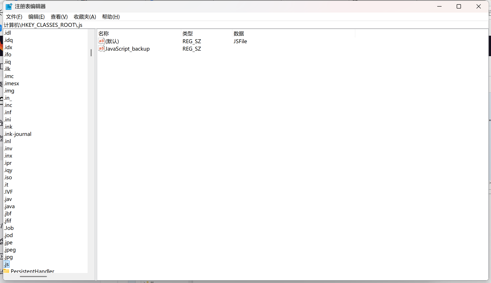

### openConnect问题汇总
#### Could not open C:\Users\daip\AppData\Local\Temp\vpnc.log: 系统找不到指定的文件。
这是JScript错误。
<b>Cursor</b>安装程序窃取了.js关联。
##### 如何确定您是否面临与我相同的问题？请执行以下步骤：
1. 打开cmd
2. 转到安装了 OpenConnectGUI 且存在文件的文件夹。vpnc-script.js
3. Run 命令：cscript vpnc-script.js
4. 如果命令失败并显示：
    > “There is no script engine for file extension .js”
    > “输入错误: 没有文件扩展“.js”的脚本引擎。”
    > 或者类似的错误消息，那么此解决方案可能会对您有所帮助。
##### 解决方案
1. 打开注册表编辑器 （regedit.exe） 并转到 \HKEY_CLASSES_ROOT\.js
2. 将默认值设置为JSFile
    > 正确的注册表应该如图所示
